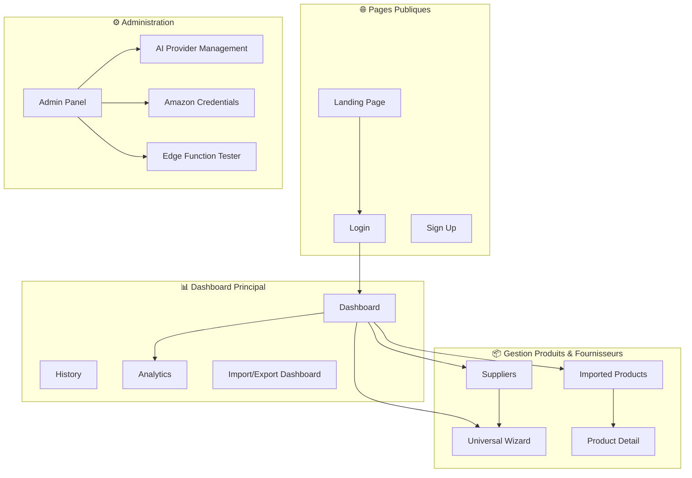
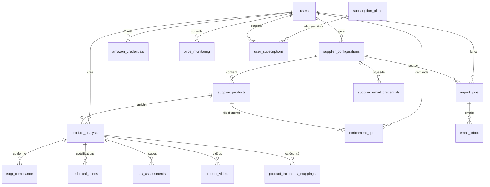
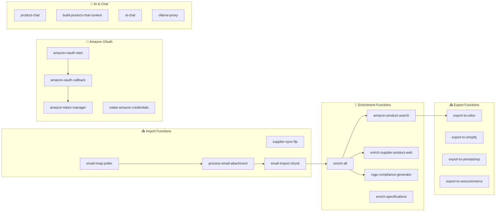
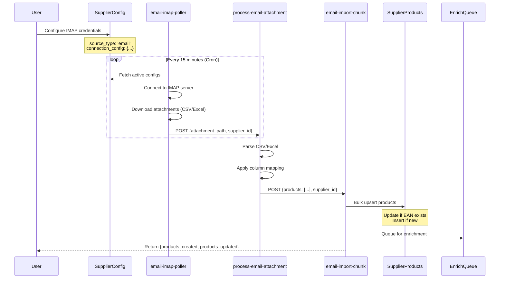
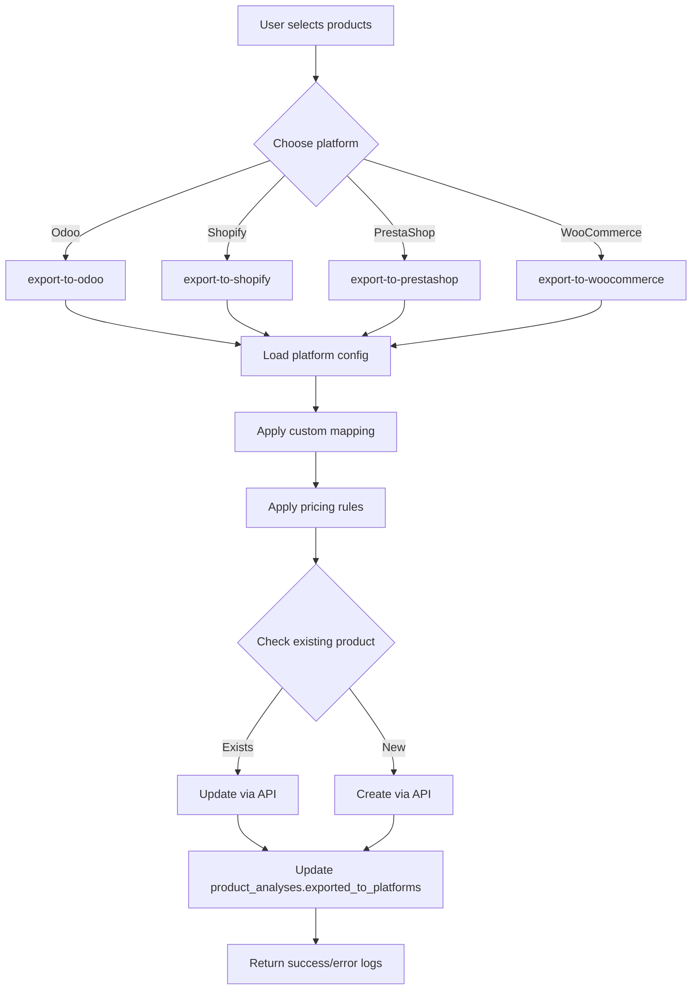
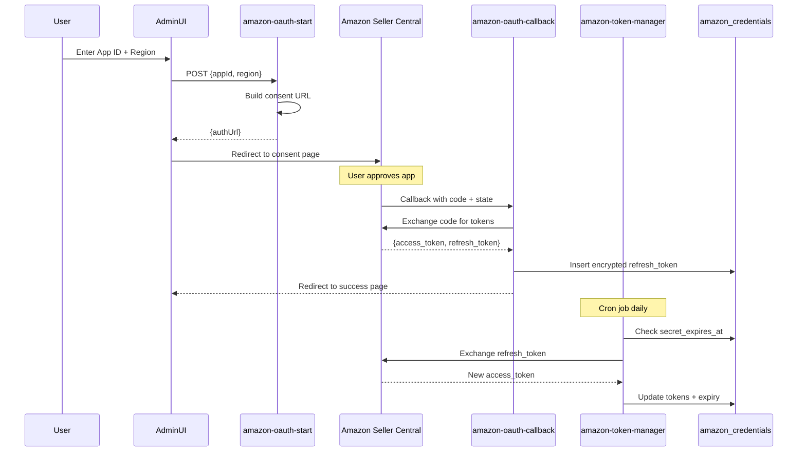
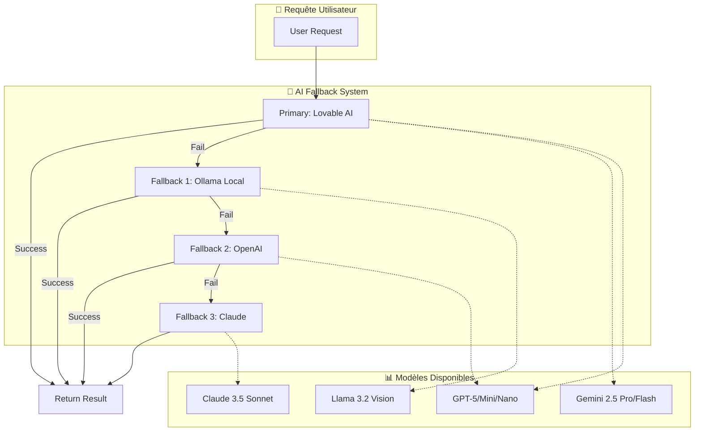
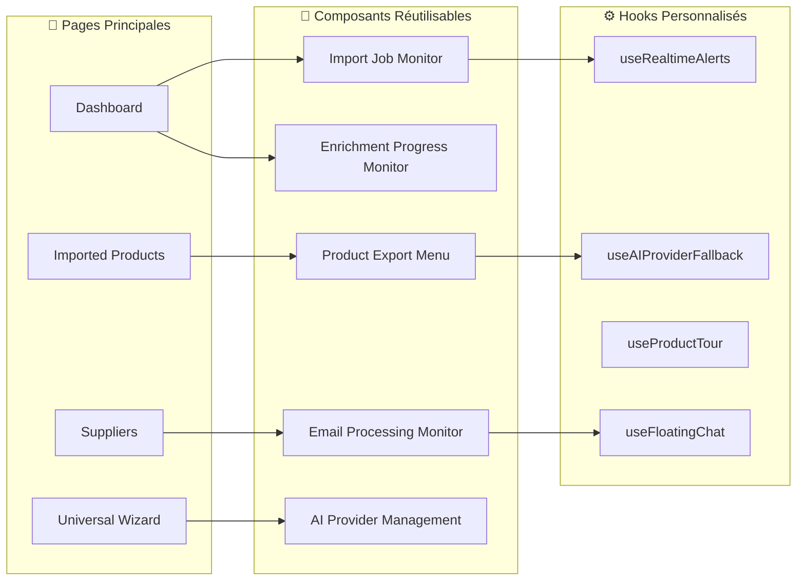
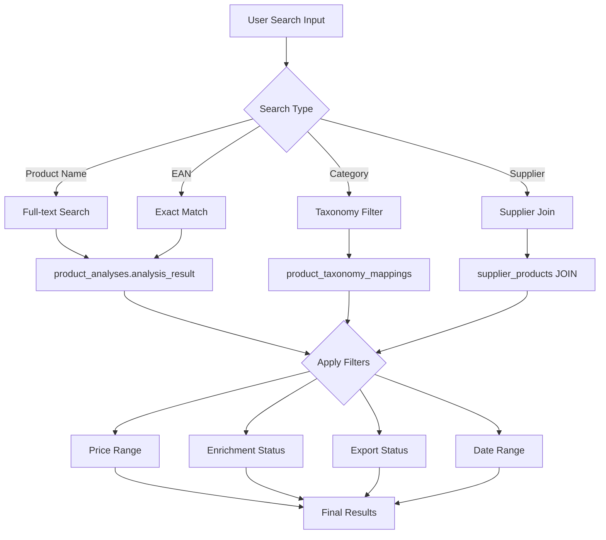

# Architecture Complète de l'Application - Documentation Claude Dev

## 🎯 Vue d'ensemble de l'application

**Nom** : Système de Gestion et Enrichissement de Catalogue Produits
**Stack** : React + Vite + TypeScript + Supabase (Lovable Cloud) + Amazon SP-API
**Fonctionnalités clés** : Import multi-sources, enrichissement IA, export multi-plateformes, gestion fournisseurs

---

## 📑 1. Architecture des Pages



---

## 🏗️ 2. Schéma de Base de Données Supabase



### 📋 Tables Principales

| Table | Rôle | Champs Clés |
|-------|------|-------------|
| `product_analyses` | Produits enrichis finaux | `analysis_result`, `image_urls`, `enrichment_status`, `supplier_product_id` |
| `supplier_products` | Produits bruts importés | `ean`, `name`, `purchase_price`, `supplier_id`, `raw_data` |
| `supplier_configurations` | Config fournisseurs | `source_type` (email/ftp/api), `connection_config`, `mapping_profiles` |
| `import_jobs` | Historique imports | `status`, `products_created`, `products_updated`, `error_logs` |
| `enrichment_queue` | File d'attente enrichissement | `enrichment_type`, `priority`, `retry_count`, `status` |
| `amazon_credentials` | OAuth Amazon SP-API | `refresh_token_encrypted`, `marketplace_id`, `secret_expires_at` |
| `rsgp_compliance` | Conformité réglementaire | `normes_ce`, `evaluation_risque`, `indice_reparabilite` |

---

## ⚡ 3. Edge Functions (124 fonctions)



### 📊 Répartition des Edge Functions

| Catégorie | Nombre | Exemples |
|-----------|--------|----------|
| Import | 28 | `email-imap-poller`, `supplier-sync-ftp`, `import-from-platform` |
| Enrichissement | 18 | `enrich-all`, `amazon-product-search`, `enrich-specifications` |
| Export | 15 | `export-to-odoo`, `export-to-shopify`, `export-single-product` |
| Amazon OAuth | 8 | `amazon-oauth-start`, `amazon-token-manager`, `rotate-amazon-credentials` |
| AI & Chat | 12 | `product-chat`, `ai-chat`, `ollama-proxy`, `claude-proxy` |
| Automation | 22 | `process-enrichment-queue`, `auto-supplier-sync`, `cleanup-old-emails` |
| Monitoring | 9 | `check-enrichment-queue-stuck`, `run-system-tests` |
| Autres | 12 | `stripe-webhook-handler`, `send-notification`, `market-intelligence` |

---

## 🔄 4. Workflow Complet d'Import



---

## 📤 5. Workflow d'Export Multi-Plateforme



---

## 🔐 6. Flux OAuth Amazon SP-API



---

## 🧠 7. Intelligence Artificielle Multi-Provider



### 🎨 Cas d'Usage IA

| Fonction | Provider Recommandé | Modèle | Raison |
|----------|---------------------|--------|--------|
| Enrichissement produit | Lovable AI | `gemini-2.5-flash` | Bon équilibre coût/performance |
| Analyse RSGP | Lovable AI | `gemini-2.5-pro` | Raisonnement complexe requis |
| Chat produit | Ollama (local) | `llama3.2-vision` | Latence faible + privé |
| Génération images | Lovable AI | `dall-e-3` | Qualité visuelle maximale |
| Classification | Lovable AI | `gemini-2.5-flash-lite` | Tâche simple + rapide |

---

## 📊 8. Composants Frontend Clés



### 📦 Composants par Catégorie

| Catégorie | Composants | Description |
|-----------|------------|-------------|
| **Monitoring** | ImportJobMonitor, EmailProcessingMonitor, EnrichmentProgressMonitor | Suivi temps réel des opérations |
| **Configuration** | AIProviderManagement, AmazonCredentialsManager, SupplierConfigForm | Gestion des intégrations |
| **Visualisation** | ImportStatsDashboard, AnalyticsCharts, PriceHistoryChart | Graphiques et KPIs |
| **Interaction** | ProductExportMenu, BulkProductLinksManager, AutomationRulesManager | Actions utilisateur |
| **Admin** | EdgeFunctionTester, MCPLibraryMarketplace, AmazonLogs | Outils debug |

---

## 🔧 9. Configuration et Secrets

### 🔐 Secrets Supabase

```javascript
// Secrets configurés dans Lovable Cloud
AMAZON_CLIENT_ID              // OAuth Amazon
AMAZON_CLIENT_SECRET          // OAuth Amazon
OPENAI_API_KEY               // Fallback OpenAI
ANTHROPIC_API_KEY            // Fallback Claude
OLLAMA_BASE_URL              // Ollama local
STRIPE_SECRET_KEY            // Paiements
SMTP_HOST                    // Notifications email
SMTP_USER
SMTP_PASSWORD
```

### ⚙️ Variables d'Environnement

```bash
VITE_SUPABASE_URL=https://ayjdtstugbqoadgipzon.supabase.co
VITE_SUPABASE_ANON_KEY=eyJhbGciOiJIUzI1NiIsInR5cCI6IkpXVCJ9...
VITE_SUPABASE_PROJECT_ID=ayjdtstugbqoadgipzon
```

---

## 🚀 10. Automatisations & Cron Jobs

```mermaid
gantt
    title Planification des Tâches Automatiques
    dateFormat HH:mm
    axisFormat %H:%M

    section Import
    Email Polling          :00:00, 15m
    FTP Sync              :00:00, 30m
    Process Pending       :00:00, 10m

    section Enrichissement
    Process Queue         :00:00, 2m
    Retry Failed          :00:00, 60m
    Check Stuck           :00:00, 30m

    section Maintenance
    Cleanup Old Emails    :03:00, 1440m
    Rotate Amazon Creds   :04:00, 1440m
    Check Expiry          :00:00, 360m

    section Export
    Auto Export           :00:00, 60m
    Sync Orders           :00:00, 15m
```



### ⏱️ Configuration Cron

| Fonction | Fréquence | Cron Expression | Rôle |
|----------|-----------|-----------------|------|
| `email-imap-scheduler` | Toutes les 15 min | `*/15 * * * *` | Poll emails fournisseurs |
| `process-enrichment-queue` | Toutes les 2 min | `*/2 * * * *` | Traite file enrichissement |
| `supplier-sync-scheduler` | Toutes les 30 min | `*/30 * * * *` | Sync FTP/API |
| `cleanup-old-emails` | Quotidien 3h | `0 3 * * *` | Supprime emails >90j |
| `rotate-amazon-credentials` | Quotidien 4h | `0 4 * * *` | Renouvelle tokens Amazon |
| `check-amazon-credentials-expiry` | Toutes les 6h | `0 */6 * * *` | Alerte expiration |
| `auto-export-manager` | Toutes les heures | `0 * * * *` | Export auto produits |

---

## 📈 11. Métriques et Monitoring

### 📊 Tables de Suivi

```sql
-- Statistiques d'import agrégées
SELECT
  import_date,
  COUNT(*) as total_imports,
  SUM(products_created) as total_products,
  AVG(processing_time_ms) as avg_processing_time
FROM import_statistics
GROUP BY import_date
ORDER BY import_date DESC;

-- Santé de la queue d'enrichissement
SELECT
  status,
  COUNT(*) as count,
  AVG(retry_count) as avg_retries
FROM enrichment_queue
GROUP BY status;

-- Logs Amazon SP-API
SELECT
  function_name,
  event_type,
  COUNT(*) as occurrences
FROM amazon_edge_logs
WHERE created_at > NOW() - INTERVAL '24 hours'
GROUP BY function_name, event_type;
```

---

## 🎯 12. Use Cases Principaux

### 📥 Import Multi-Sources

```javascript
// Email IMAP automatique
await supabase.functions.invoke('email-imap-poller', {
  body: { supplierId: 'uuid', forceSync: false }
});

// FTP/SFTP programmé
await supabase.functions.invoke('supplier-sync-ftp', {
  body: {
    supplierId: 'uuid',
    config: { host, port, username, remotePath }
  }
});

// Upload CSV manuel
await supabase.functions.invoke('supplier-import-csv', {
  body: {
    filePath: 'supplier-catalog.csv',
    delimiter: ';',
    columnMapping: { /* ... */ }
  }
});
```

### 🧠 Enrichissement Intelligent

```javascript
// Enrichissement complet (Amazon + IA)
await supabase.functions.invoke('enrich-all', {
  body: {
    analysisId: 'uuid',
    enrichmentTypes: ['amazon', 'specifications', 'rsgp', 'images']
  }
});

// Recherche Amazon SP-API
await supabase.functions.invoke('amazon-product-search', {
  body: {
    query: 'iPhone 15 Pro',
    marketplace: 'A13V1IB3VIYZZH' // EU
  }
});
```

### 📤 Export Multi-Plateforme

```javascript
// Export vers Odoo avec mapping custom
await supabase.functions.invoke('export-to-odoo', {
  body: {
    analysisId: 'uuid',
    platformConfigId: 'uuid',
    customMapping: {
      'product_name': 'name',
      'ean': 'barcode',
      'purchase_price': 'standard_price'
    },
    applyPricingRules: true
  }
});
```

---

## 🔍 13. Recherche et Filtrage Avancé



### 🔎 Exemples de Requêtes

```sql
-- Produits enrichis mais non exportés
SELECT pa.*
FROM product_analyses pa
WHERE pa.enrichment_status->>'amazon' = 'completed'
  AND pa.exported_to_platforms = '[]'::jsonb
ORDER BY pa.created_at DESC;

-- Top fournisseurs par volume import
SELECT
  sc.supplier_name,
  COUNT(sp.id) as total_products,
  AVG(sp.purchase_price) as avg_price
FROM supplier_configurations sc
JOIN supplier_products sp ON sp.supplier_id = sc.id
GROUP BY sc.id, sc.supplier_name
ORDER BY total_products DESC
LIMIT 10;

-- Produits avec erreurs enrichissement
SELECT pa.*, eq.error_message
FROM product_analyses pa
JOIN enrichment_queue eq ON eq.analysis_id = pa.id
WHERE eq.status = 'failed'
  AND eq.retry_count >= eq.max_retries;
```

---

## 🛡️ 14. Sécurité et RLS Policies

### 🔐 Principales Politiques RLS

```sql
-- Users can only see their own data
CREATE POLICY "Users can view their own analyses"
ON product_analyses FOR SELECT
USING (auth.uid() = user_id);

-- Super admins have full access
CREATE POLICY "Super admins can manage all"
ON amazon_credentials FOR ALL
USING (has_role(auth.uid(), 'super_admin'));

-- System functions can insert logs
CREATE POLICY "System can insert logs"
ON amazon_edge_logs FOR INSERT
WITH CHECK (true);
```

### 🔑 Gestion des Rôles

| Rôle | Permissions | Tables Accessibles |
|------|-------------|-------------------|
| `user` | CRUD sur ses données | `product_analyses`, `supplier_configurations`, `import_jobs` |
| `admin` | Lecture sur toutes données | + `audit_logs`, `user_subscriptions` |
| `super_admin` | CRUD sur toutes données | ALL tables + `amazon_credentials`, `ai_prompts` |

---

## 📚 15. Ressources et Documentation

### 📖 Fichiers de Référence

| Fichier | Description |
|---------|-------------|
| `src/lib/mcpLibraries.ts` | Définitions des MCP servers (Odoo, PrestaShop, etc.) |
| `src/lib/odooMCPData.ts` | Tools et use cases Odoo MCP |
| `src/lib/prestashopMCPData.ts` | Tools et use cases PrestaShop MCP |
| `supabase/config.toml` | Configuration edge functions + auth |
| `src/integrations/supabase/types.ts` | Types TypeScript auto-générés |

### 🔗 Intégrations Externes

- **Amazon SP-API** : Authentification OAuth 2.0 + endpoints Catalog/Inventory
- **Odoo MCP Server** : `npm install odoo-mcp-server` (déjà installé)
- **PrestaShop MCP** : Disponible via MCP marketplace
- **Ollama** : Modèles IA locaux (Llama 3.2, Mistral, etc.)
- **Stripe** : Gestion abonnements et paiements

---

## 🎓 Résumé pour Claude Dev

### 🚀 Quick Start

```bash
# 1. Créer un fournisseur
POST /suppliers → {name, source_type: 'email', config: {...}}

# 2. Lancer import email
INVOKE email-imap-poller → Parse attachments → Insert supplier_products

# 3. Enrichir produits
INVOKE enrich-all → Amazon API + IA → Update product_analyses

# 4. Exporter vers plateforme
INVOKE export-to-odoo → Transform data → POST to Odoo API
```

### 🔥 Points d'Attention

- **Secrets** : Toujours utiliser Lovable Cloud secrets (jamais hardcoder)
- **RLS** : Vérifier policies avant requêtes DB
- **AI Fallback** : Prioriser Lovable AI (no API key needed)
- **Amazon OAuth** : `verify_jwt = false` sur `amazon-oauth-start`
- **Cron Jobs** : Configurés dans `config.toml` (section `[functions.{name}]`)

### 📊 Métriques Clés

- **124** Edge Functions déployées
- **15+** Tables Supabase avec RLS activé
- **12+** Plateformes d'export supportées
- **4** Providers IA avec fallback automatique
- **~40** Composants React réutilisables

---

## 🎯 Objectif Final

**Automatiser à 100% le flux Import → Enrichissement → Export avec monitoring temps réel et multi-tenancy sécurisé.**

---

*Documentation générée le 2025-10-30*
